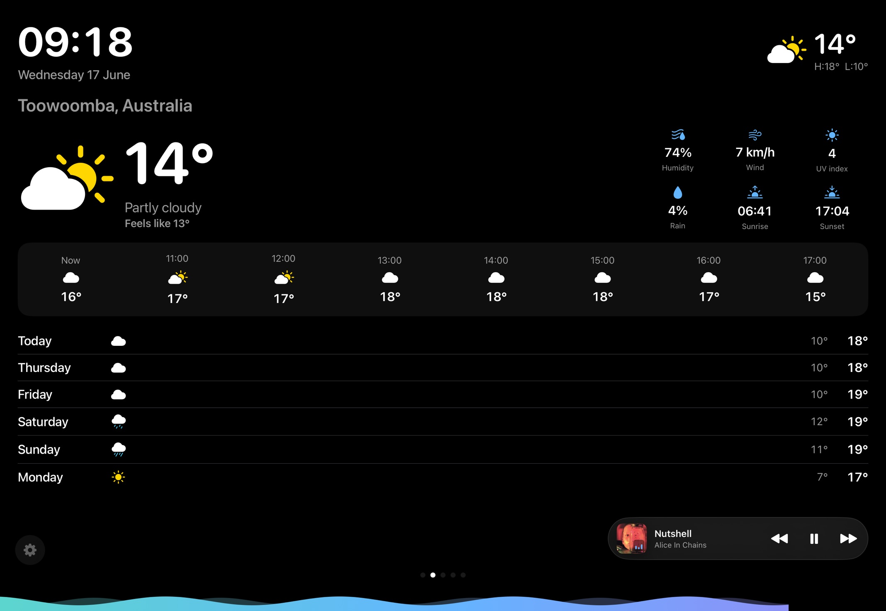
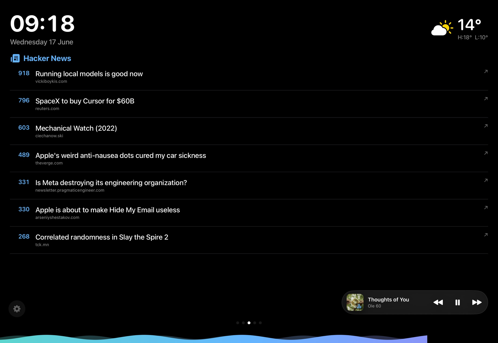
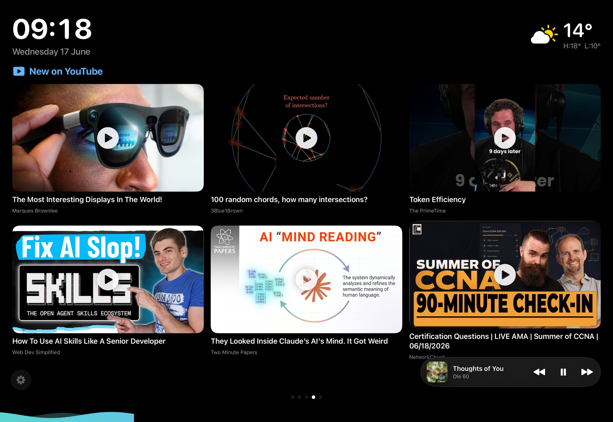
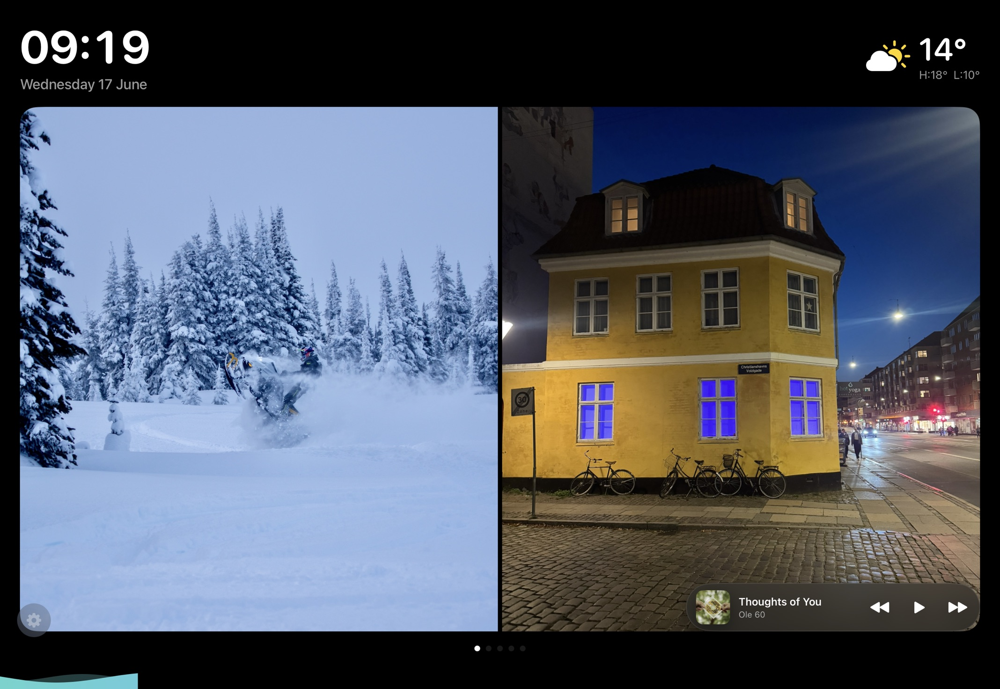

# Glance

**[🌐 glance website](https://bradystroud.github.io/glance/)**

An always-on iPad dashboard. Rotates through full-screen scenes:

- 📷 **Photos** — straight from your on-device photo library (incl. iCloud) via PhotoKit
- 🌤 **Weather** — current conditions + today's high/low (Open-Meteo, no API key)
- 📰 **Hacker News** — front-page tech/dev stories
- ▶️ **YouTube** — newest videos from channels you follow (thumbnail + tap-to-open, never autoplays)
- 🔀 **My open PRs** — your open pull requests across GitHub

The screen stays awake while the app is open (`isIdleTimerDisabled`). A persistent header shows the time, date, and temperature.

## Screenshots

<table>
  <tr>
    <td width="50%"></td>
    <td width="50%"></td>
  </tr>
  <tr>
    <td width="50%"></td>
    <td width="50%"></td>
  </tr>
</table>

## Requirements

- **Full Xcode** (from the Mac App Store) — Command Line Tools alone can't build iOS apps.
- A free Apple ID for signing (re-sign every 7 days), or a paid Developer account for a year / TestFlight.

## Setup

```sh
./setup.sh
```

This installs [XcodeGen](https://github.com/yonyz/XcodeGen) (via Homebrew), generates `Glance.xcodeproj`, and opens it. Then in Xcode:

1. Select your iPad as the run destination (plug it in, trust the Mac).
2. **Signing & Capabilities** → pick your Team (your Apple ID) and a unique bundle id if `dev.stroud.glance` is taken.
3. ⌘R to build & run.

On first launch, grant photo access when prompted.

## Configure

Tap the **gear button** (bottom-left) to open Settings — everything is editable on-device and persists in UserDefaults:

- **Pages** — toggle which scenes appear (Photos, Weather, Hacker News, YouTube, PRs).
- **Weather location** — latitude / longitude (defaults to Brisbane).
- **GitHub** — username and an optional read-only token (raises the rate limit and includes private PRs; stored only on-device).
- **YouTube channels** — one channel ID per line (`UC…`); text after `#` is a label and is ignored. Find an ID via a channel page's source (`channelId`).
- **Timing** — page duration, photo duration, and data refresh interval.

Defaults live in [`Glance/Config.swift`](Glance/Config.swift). Empty scenes (no YouTube channels, no open PRs, etc.) are automatically skipped in the rotation.

## Keeping it on, permanently

- Settings → Display & Brightness → **Auto-Lock → Never** (belt-and-suspenders; the app already disables idle).
- **Guided Access** (Settings → Accessibility) locks the iPad to just this app — triple-click to start.
- Keep it on a charger; old iPads are perfect for this.

## Notes

- Pure SwiftUI, no backend. All data is fetched on-device via `URLSession`; no keys leave the device.
- iPad-only, landscape. Targets iOS 17+.
